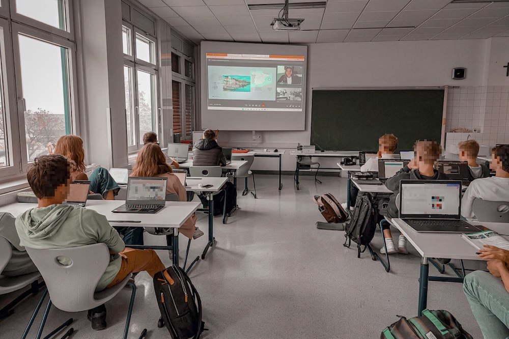

Thanks to the [Skype A Scientist Program](https://www.skypeascientist.com) I was connected to Gerda Resinger from the [Linzer Technikum](https://www.litec.ac.at/) Highschool to give last year students a talk.

My talk was divided in four main sections:
1. Who am I, what made me decide to do a PhD in Computer Science and Technology and which has been my trajectory.
2. What is my thesis about from a non-technical point of view. Focusing on cybersecurity and artificial intelligence. 
3. Which can be their trajectory and some tips on how to overcome difficulties when coping with different aspects such as: choosing a degree, studying an engineering or others.
4. Questions. Some of them were sent in advance and others were improvised.

The slides I used for the presentation are available [here](https://cfusterbarcelo.github.io/files/SkypeAScientist-08-11.pdf).

If you are reading this because you are interested in my project and trajectory and you have some students interested in my research, don't hesitate to contact me! I will be very happy to give this talk again!

